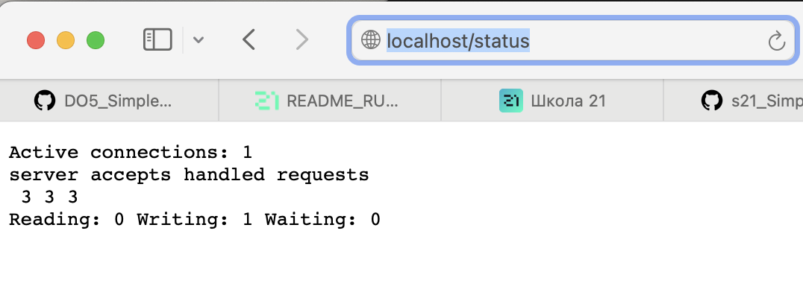

## 1. Готовый докер
+ Возьмем официальный докер-образ с nginx и скачаем его при помощи docker pull 

    

+ Проверяем наличие докер-образа через docker images 
    

+ Запускаем докер-образ через 
`docker run -d --name nginxer nginx`
    

+  Проверяем, что образ запустился через 
`docker ps`

  

+ Посмотрим информацию о контейнере через 
  `docker inspect nginxer`

   

+ По выводу команды  определяем:

    * размер контейнер 1095 bytes
    
    * список замапленных портов 80/tcp:[]
    
    * ip контейнера 172.17.0.3
    

+ Останавливаем докер контейнер через `docker stop ngixer` и проверяем, что контейнер остановился `docker ps`
    

+ Запускаем докер с портами 80 и 443 в контейнере, замапленными на такие же порты на локальной машине, через команду run и проверяем 
`docker run -d -p 80:80 -p 443:443 nginx`
    

+ Проверяем, что в браузере по адресу localhost:80 доступна стартовая страница nginx

Перезапускаем докер контейнер через `docker restart [container_id|container_name]`  и проверяем, что контейнер запустился `docker ps`

## 2. Операции с контейнером

+ Прочитаем конфигурационный файл nginx.conf внутри докер контейнера через команду `docker exec quirky_goodall cat /etc/nginx/nginx.conf`

      

+ Создаем на локальной машине файл nginx.conf и настраиваем в нем по пути /status отдачу страницы статуса сервера nginx.
      

+ Копируем созданный файл nginx.conf внутрь докер-образа через команду docker cp.
      

+ Перезапускаем nginx внутри докер-образа через команду exec.
      

+ Проверяем, что по адресу localhost/status отдается страничка со статусом сервера nginx.
      

 + Экспортируем контейнер в файл container.tar через команду export и останавливаем  контейнер.
       

+ Удаляем образ через `docker rmi nginx`, не удаляя перед этим контейнеры. Затем удаляем остановленный контейнер: `docker rm quirky_goodall`.
       

+ Импортируем контейнер обратно через команду import и запустим импортированный контейнер.
      

+  Проверяем, что по адресу localhost/status отдается страничка со статусом сервера nginx.
      

## 3. Мини веб-сервер

Напишем мини-сервер на C, который будет возвращать простейшую страничку с надписью Hello World!
+ Создадим файл mini_server.c, в котором будет описана логика сервера  

   

+ Создадим файл nginx.conf, который будет проксировать все запросы с порта 81 на порт localhost:8080

    

+ Теперь выкачаем новый docker-образ и на его основе запустим новый контейнер.
    

+ После перекинем конфиг и логику сервера в новый контейнер и запустим

    `docker cp nginx.conf gifted_edison:/etc/nginx/` 
    
    `docker cp mini_server.c gifted_edison:/`

    `docker exec gifted_edison gcc ./mini_server.c -l fcgi -o mini_server` - компилируем FastCGI server.

    `docker exec gifted_edison spawn-fcgi -p 8080 fcgi_server` 
    
    `docker exec gifted_edison nginx -s reload` - запуск.

     

Проверяем, что в браузере по localhost:81 отдается написанная  страничка.

   

##  4. Свой докер
+ Напишем свой docker-образ, который собирает исходники 3-й части, запускает на порту 80, после копирует внутрь написанный нами nginx.conf и, наконец, запускает nginx.
    * mini-server.c
      

    * nginx.conf
     

    * run.sh
     

    * Dockerfile
     

+ Соберем написанный docker-образ через команду docker build, при этом указав имя и тэг нашего контейнера 
     

+ Проверяем с помощью `docker image`.
     

+ Запускаем собранный docker-образ с мапингом порта 81 на порт 80 локальной машины.

   

+ Проверяем, что по localhost:80 доступна страничка написанного мини сервера.

   

+ Дописываем в nginx.conf проксирование странички /status, по которой надо отдавать статус сервера nginx.
    
   

+  Теперь перезапустим nginx в своем docker-образе командой nginx -s reload

     

+ Проверяем, что по localhost/status отдается страничка со статусом nginx.
     

## 5. Dockle

+ Просканируем docker-образ из предыдущего задания на предмет наличия ошибок командой `dockle [image_id|repository]`
     

+ Исправим ошибки и соберем новый образ и проверим его. 

    

## 6. Базовый Docker Compose

+ Создадим конфигурационный файл docker_compose.yml
    

+ Внесем изменения в nginx.conf
    

+ Поднимем контейнер командой `docker-compose build`
    

+ Далее  поднимаем сбилженный контейнер командой docker compose up
    
    
+ Проверяем, что по localhost:80 отдается страничка со статусом nginx.
     

